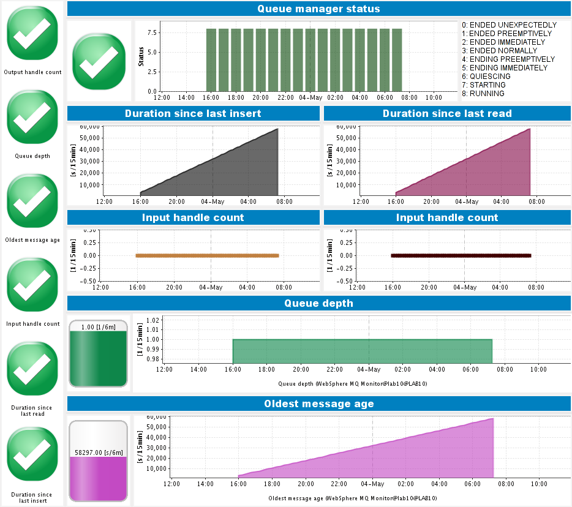
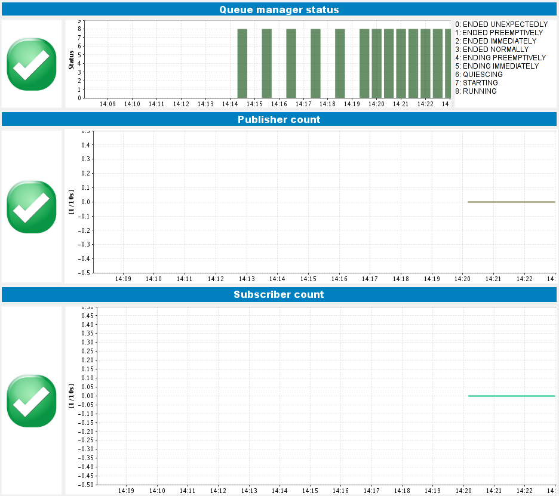

# WebSphere MQ Monitoring Fastpack

## Overview

The dynaTrace FastPack for WebSphere MQ enables easy out-of-the-box monitoring of WebSphere MQ Queues, Topics and Subscriptions. The FastPack consists of a custom Monitor, Sample Profile and
Dashboards.

## Fast Pack Details

| Name |WebSphere MQ Monitoring FastPack
| :--- | :---
|Version | 1.0.3
| Supported dynaTrace Versions | >= 5.5
| Author | dynaTrace software
| License | [dynaTrace BSD](dynaTraceBSD.txt)
| Support | [Community Supported ](https://community.compuwareapm.com/community/display/DL/Support+Levels#SupportLevels-Community)
| Download | [System Profile and Dashboards ](WebSphereFastpackDashboardsAndProfile.zip)  
| | [WebSphere MQ Monitoring Plugin](com.dynatrace.plugins.mq_2.0.0.jar) 

## WebSphere MQ Queue Dashboard

The WebSphere MQ Queue Dashboard enables you to easily monitor a a Queue and its Queue Manager. It shows you

  * Whether the QueueManager is running 

  * How much time passed by since the last enqueue and dequeue 

  * How many processes are currently reading from or writing to the queue 

  * How many messages there currently are on the queue 

  * How old the oldest message is giving you  
This gives you an idea if messages stay on the queue longer than should be.

In addition it contains traffic lights for all major metrics, which when you define your thresholds enable you too see the health state of your queue at one single glance

## WebSphere MQ Topic Dashboard

The WebSphere MQ Topic Dashboard enables you to easily monitor Topic and its Queue Manager. It shows you

  * Whether the QueueManager is running 

  * The active Publisher and Subscriber count 

In addition it contains traffic lights for all major metrics, which when you define your thresholds enable you too see the health state of your queue at one single glance

## WebSphere MQ Monitor

The Monitor uses the local WebSphere MQ installation of the running collector to gather its metrics. This means that at least the MQ client needs to be installed on the machine that is running the
dynaTrace Collector  
It allows to monitor all major MQ types: Queue, Topic, Subscription.

The only thing to configure are the

  * Binary Installation directory of the WebSphere MQ client/server installation 

  * Queue manager name 

  * queue/topic/subscription name 

For more information please see the [WebSphere MQ Monitoring plugin](https://community.compuwareapm.com/community/display/DL/WebSphere+MQ+Monitoring+Plugin) page.

## FastPack Information

The WebSphere MQ Monitoring FastPack contains everything to get started with WebSphere MQ monitoring.

  * A system profile with preconfigured schedules for monitoring the demo queue (_postcard_). 

  * A WebSphere MQ Queue Dashboard for monitoring the Queue manager and a queue. 

  * A WebSphere MQ Topic Dashboard for monitoring the Publishers and Subscribers of a topic 

## Installation

  1. Download and import the Dashboards and the System Profile on your dynaTrace Server 

  2. Download and import the Monitor Plugin to your dynaTrace Server 

